# 04/03/2026 11:30 p.m. : Initial Research

Why am I making this toolhead? Well I need more funds for my blueprint designed abomination. Currently, the "best" non-CPAP bedslinger toolhead is the LH Stinger toolhead from what I've seen. Unfortunately, it's so good and well-thought that there aren't really many alternatives I can look at in terms of performance. So I guess my best course of action would be to design a toolhead, any toolhead, as well-thought out as I can make it in the few days I have and then iterate once I get the fans and can actually test ducts and all.   
Spent like an hour doing research throughout various Discords and in hopes of finding some more unique (but not completely stupid) fan options. I really like how the Trinity toolhead looks with the 3628 fans. So much so that I even slapped in on my WIP design to see how it'd look:

Yeah it's ridiculous...I'd lose ton of Z space, even though I could adapt the motor mounts so that I wouldn't lose that much X. Plus the 3628s are simply overkill, especially since I can just add sheet cooling like the stinger pretty easily as it's a bedslinger. The other fan option I found would be 5020s, which are like 5mm wider than the 5015s, and that seemed like an interesting option, but it turns out that it'd just be better to get some good 5015s, like the Berseker Vindrs for example. The 5020s don't have that much more CFM, the options are more limited, and thus the RPM options are as well. With 5015s on the other hand they go up to like 9500 RPM I think. RPM, as I just learned, matters because if you can't ramp them up and down you might find yourself over-cooling stuff at low speed, which might result in bridges for example curling up from thermal shock. According to PureComedi on the LH Stinger Discord this shouldn't be an issue if I don't print slower than 100 mm/s, so yeah CFM is mainly what I'm looking at. Anyways, seems I can worry about the exact specs of the 5015s after I finish designing a rough draft. Honestly using 5015s would also be good because if my toolhead doesn't work that great and I don't have time to work on it anymore once I've built v1 (because of exams) I can just print a Stinger toolhead and use that until I get around to it. 

So, design constraints. I'll need to use the LH Stinger belt block or something similar, as I can't tension the belts in any other place because of AWD X. I'll be using a Dragon Ace Volcano as my hotend, which I'll be getting from my own money, as I obviously can't fit that into this $75 budget. My toolhead obviously can't be direct clone of the Stinger or any other design, but I do want it to have like at least 6-70% of the performance (in CFD at least) that the former does. I'll probably be using a sherpa mini or a protoxtruder 2.0, gotta decide at some point. I want to try and have a decent COM. COM matters because the higher the accel/speed the higher the torque on the toolhead, and if the COM isn't as close to the rail block as possible it can wear out the rail pretty fast and also mess up the print from what I understand. I'll be using SimScale for the CFD, even though someone on the Monolith Discord suggested OpenFoam, as the former seems to be the most beginner friendly and TeachingTech and NeeditMakeit have tutorials on it over on Youtube. Oh and obviously I'll try to make the toolhead as rigid and light as possible. Rigidity is evidently the priority though, and I also have 48v AWD X, so weight shouldn't matter as much as it might on other setups. 

Ducts. Rewatched James Pray's video (colphaer on the Ice Cream Factory Discord) on duct design. I actually have a journal entry regarding toolhead and ducts in my blueprint project, but yeah forgot everything in one month. The Golden Rule of duct design according to him is to narrow your ducts gradually. Don't narrow a duct by more than 11 degrees measured from wall to wall. Secondly, if you are going for cooling, the goal is to get fast airflow out the end. You can get fast cooling by narrowing the outlet, but after a certain tipping point it starts to choke the airflow. You need to find outlet_area/input_area x 100 which equals the final reduction percentage. Unfortunately, this can only be tested empirically, which in my case is kind of impossible as I do not have the fans to test them yet. So I'll just use the outlet area dimensions of the Stinger as placeholder values and then adjust them once I actually get the toolhead. Though if I go for more of a Archetype Mjolnir setup, with the fans oriented like almost horizontal relative to the gantry then I don't think it'd matter *that* much.   Another tip listed in the video is to try and set your start and end constraints (outlet/input area) and then try and join them in the middle. Don't think that'll matter as much in my case but yeah. Ducts should obviously be as smooth as possible, with as big curves as possible.    

Spent like 40m trying to find an accurate Dragon Ace Volcano CAD model. In the end I took the main body from the UAP toolhead CAD and the sock from the Trinity CAD. The sock is obviously just a rough estimate that the creator of Trinity used, but it's the best thing I've found so it'll have to do. I also assigned some colors to it so that it'd look closer to the original. I'll have to assign the materials (so I get the proper mass for calculating the COM) tomorrow.

Anyway moving on to other orders of business, I'll be using the Protoxtruder 2.0. So I accidentally discovered that Kevin (the one and only, creator of KevEnder) also uses the Protoxtruder for his toolheads. Talked with him a bit, and he gave me an onshape link to a version with all the mass stuff assigned, which is amazing, as I dreaded assigning materials for each of the gears, collet, motor, etc. I didn't even have a version with the gears. Anyway he said that the stock bearings for both the HGX and the HGX 2.0 are shit, and that they'll wear down in a month and have horrible backlash afterwards. He said he swapped the bearings for larger bearing and has been running it with no issues for the past year or so, 683 instead of mr63. The Onshape link he gave me was his modified version of the Protoxtruder which uses said bearings and also has a third bolt in the back which according to him increases rigidity by a lot. So I'll be using his version...will have to see from where to source the bearings. 
Did a little work on the basic toolhead cage. Referenced both the Stinger and Trinity toolhead (the latter as it's made for the Dragon Ace Volcano). 
 

**Total Time Spent: 6h**

# 05/03/2026 **12:48 a.m. : First Rough CAD Design 

Spent some time assigning materials to the Dragon Ace and the fans. Speaking of the fans, I think I'll go with a 2510 axial for cooling the heatsink. Stinger uses a 4010 axial, and there's also others that use a 3010, but both the UAP and the Trinity use the 2510, and as the Trinity use the Dragon Ace Volcano as well and is considered one of the best monolith toolheads I think I'll be fine. Plus it's more compact. For the hotend, I just referenced the diagram they have on their website and assigned the most similar materials I could find in Onshape's material library, and for the fans I just set them as Nylon. Printed parts will be assigned as PC/ABS. I was worried a few days ago that I'd have to find a perfect weight/mass for each part and then custom assign that in the CAD, but after seeing how Kevin assigned his I realized that I'm overcomplicating things...the COM is just an estimate after all. I still have to assign the materials for the Stinger tensioner block, but I'll do that later as I think I might have to modify that. I also have set a rough position for the fans. I think in the end this will end up as basically a Mjolnir inspired simpler/better core bedlsinger toolhead.  
 

Did some more CAD work and here's how it's looking right now. 
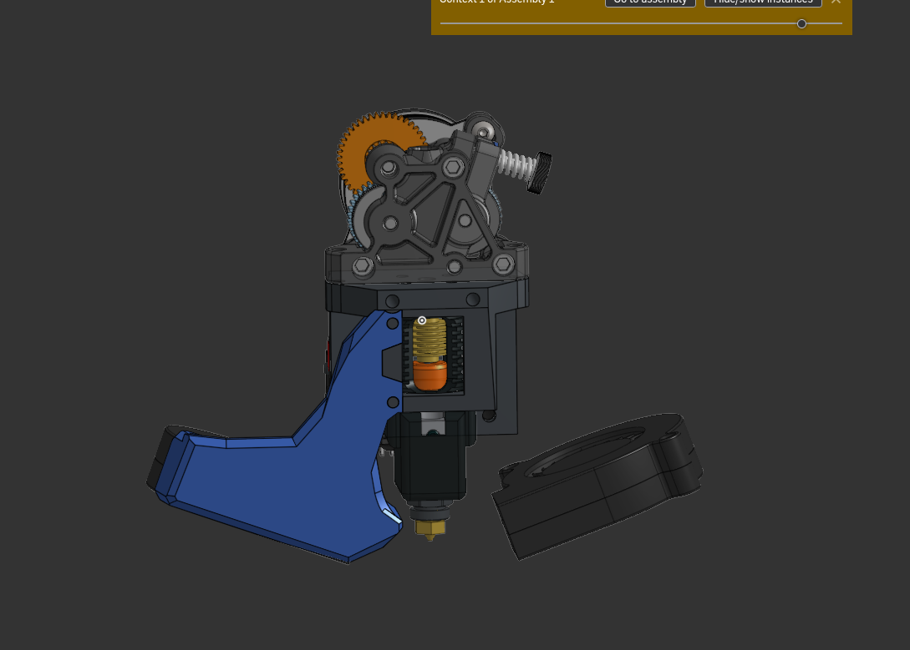
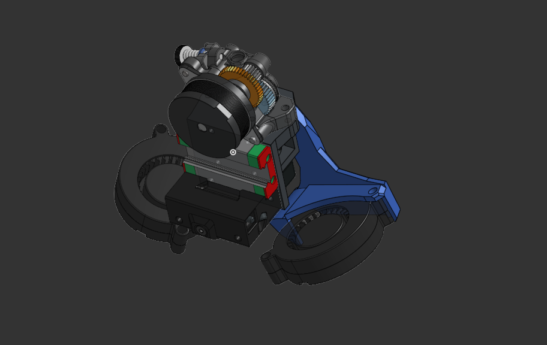
I messed around with the chamfers and like did partial chamfers of different dimensions, and in my opinion it's looking pretty good.

The two main problems I ran into today were accidentally forgetting that the fans have to be above the nozzle (I know, I'm stupid, but in my defense it's 12 am), which you can see in the above pics and was relatively easy to fix (though tedious) and more importantly the 2510 screw holes. Now the problem is that with how I'm planning to mount the like 5015 fan "wings" to the core I'm reusing the screws of the axial fan, but I don't have the space to fasten it in the back, as the potential heat insert/hex would interfere with the heat sink. While I have solved the former problem I cannot at the moment think of a good way to solve the latter. I'll have another go at it tomorrow.

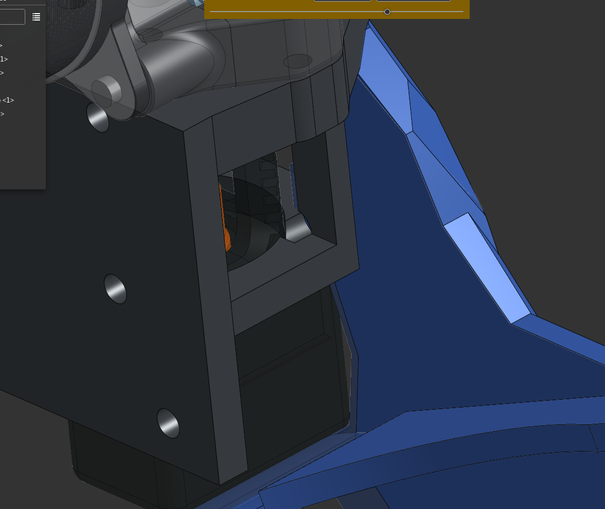
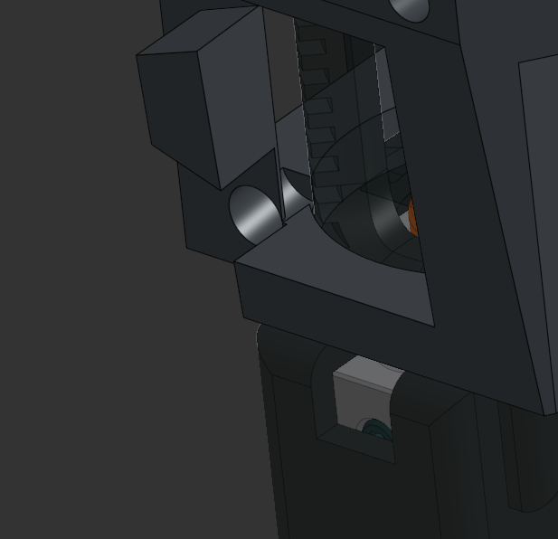

**Total Time Spent: 5h**

# 10/03/2026 10:47 p.m. : Started Again   
Started from scratch. What I had made till now was just a rough draft, and I had made some pretty bad mistakes, so thought it'd be better to start with a clean slate. It's getting kind of hard to journal now, as most of the time is wasted on small CAD stuff (eg. an error here, go back and fix it, rethink X feature so it's "cleaner", etc). Anyways, after experimenting some more with a 3010 I've decided to go with a 2510 after all, as I think I can manage mounting it. So here's what I currently have, after several more hours. Had another free-ish day, so I was fortunate enough to be able to get some decent hours in.
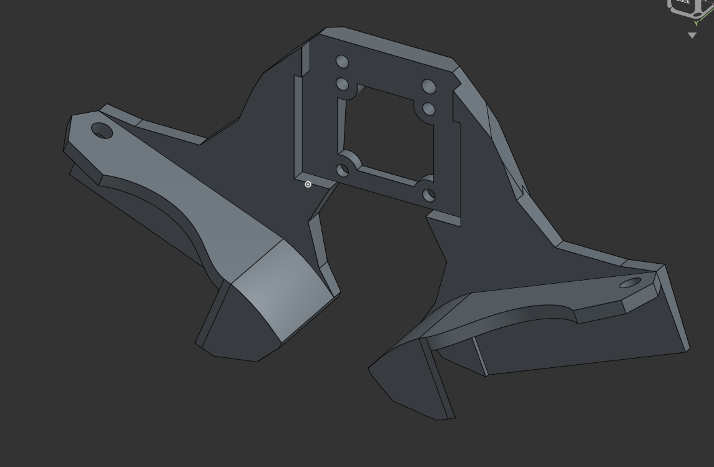
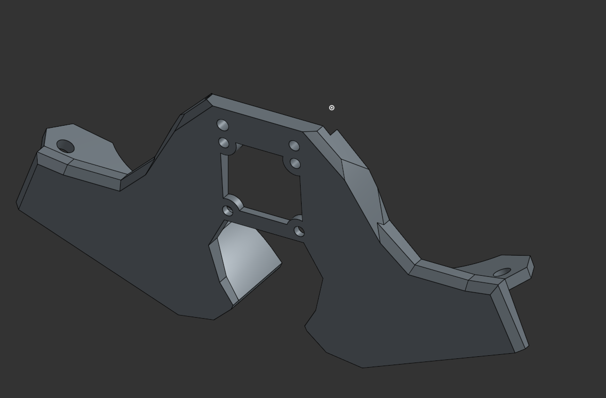
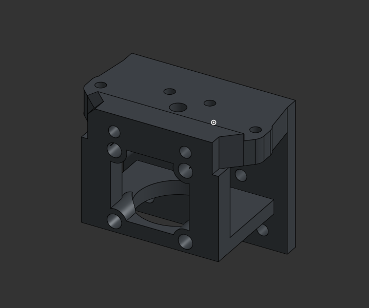  
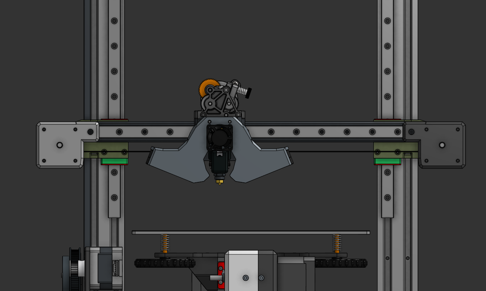
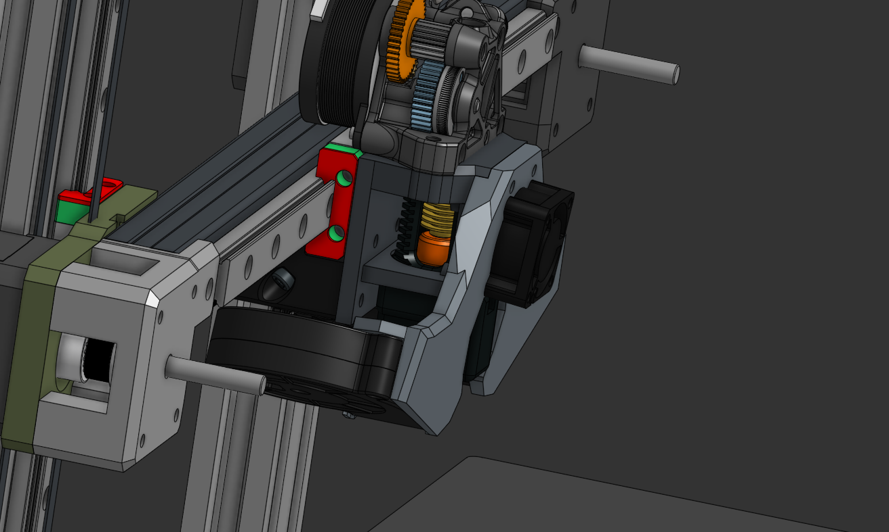

**Total Time Spent: 6h**

# 17/03/2026 5:16 p.m. : Refining, Finishing up  
  So, back at it. As I'm trying to like refine it add the final touches and all that, I'm faced with the unfortunate and rather surprising fact that I did not in fact make this very parametric. Like it seems that every time I try to adjust something towards the beginning of the timeline everything breaks. One thing I've learned is to use the Project tool sparingly. For some reason geometry made using it breaks pretty often. And my whole feature tree is one continuous mess...I really need to take a starter course or something to really understand how certain features work and why their errors happen. Nonetheless, this toolhead, while not as polished and "good" as it could have been has been an excellent learning experience, and I think I did a relatively decent job of keeping general constraints in mind, or well at least those that I knew of. 

  Ok enough with the rant. So because I really didn't want to mess with the ribs for front fan mount I decided I'll have a go at the back obraces. While printing them vertically (with the side that sits on the fan on the print bed) would have been slightly easier in terms of designing them, but well that wouldn't be very strong because of the layer line orientation.So I used two extrudes and a draft to make them printable on the side. 

As you can see in the last picture, the printing orientation of the tensioner means that I'll have to print at least some part of the like cutout where the brace slots in the tensioner with some supports, hence why I angled the upper side (easier printing with less supports). 

Another problem I ran into is the COM. I knew it wouldn't be perfect, but this still is a bit worse than I expected. Thought once I add the hardware of the fan mounts and the brace and all it would hopefully be better or something. Oh well. Asked in the LH Stinger Discord though, and LH said it would be fine. Still, it could be better. Messed a bit with the extruder after adding all of the hardware:

While it does help a bit, I don't think it's worth the effort + the increased likelihood of a jam. Maybe in a future version, we'll see. I'm probably giving it more attention then necessary (most likely a result of staying too much in the Monolith Discord haha). 

Other things I've done are moved the hotend down a bit (heatsink more centered in the axial's airflow), added a small "brace extension" to make sure the hotend is still braced in the proper section, strengthened bottom axial heat insert holes, added heat insert hole places for the screws that hold the tensioner block,  made a hex pattern remove to save a bit of weight, and added some ribs to the fan mounts. Been putting the latter off for some time, but well had to do them eventually. I think they are rigid enough but we'll see.  

Oh and also chamfered sections of the toolhead cage to make it look nicer. 
**Total Time Spent: 3h**

# 19/03/2026 6:20 p.m. : Refining, Finishing up  
Added all of the remaining hardware (such as the hotend screws), modified the tensioner block to fit the back screw brace, added yet more chamfers, and yeah that's about it. It's surprising how little that is...took such a long time too. It's really annoying how little things like this eat up your time when you think they'll be quick.
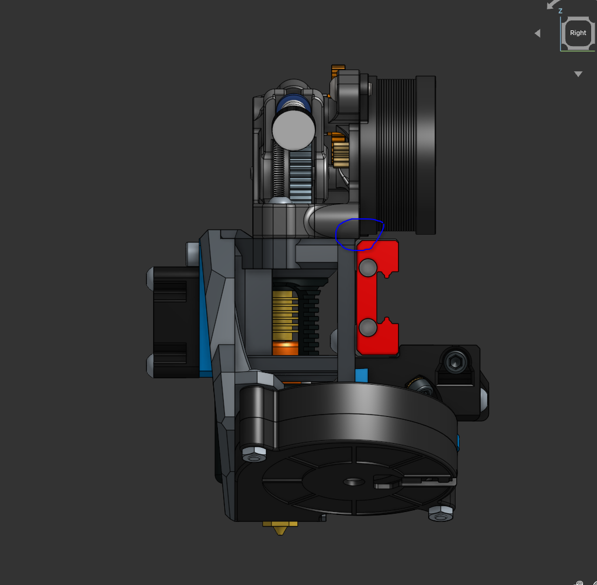
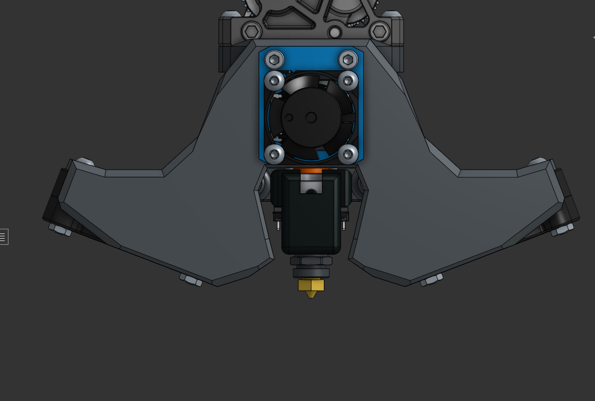
Oh yeah and also fixed the extruder. Had to raise the top surface a bit as the motor was slightly clipping into the rail block. Obviously, this resulted in bunch of errors, which were annoying but fortunately not very hard to fix. Another reminder to put more thought into designing things parametrically.

Also made the klicky mount (later on in the day). Here is the first version. Unfortunately, with this the way it is the right hexnut is too close to the tip of the nozzle in the Z, like 1mm. So I flipped the screws so that the hexnuts are on top. Gonna use some countersunk M3s I have instead of shoulderbolts/socket head like the rest of the screws use, as they have a lower profile. 
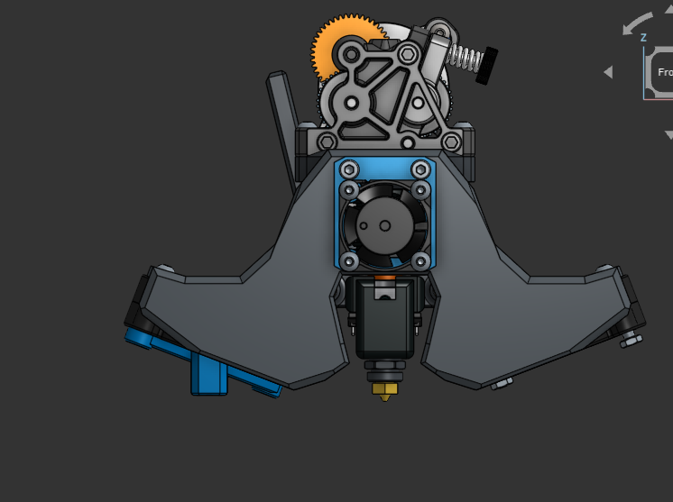
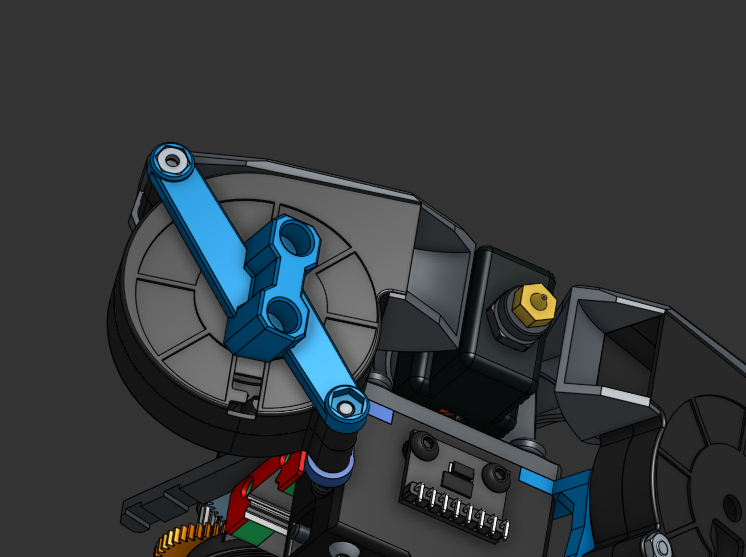
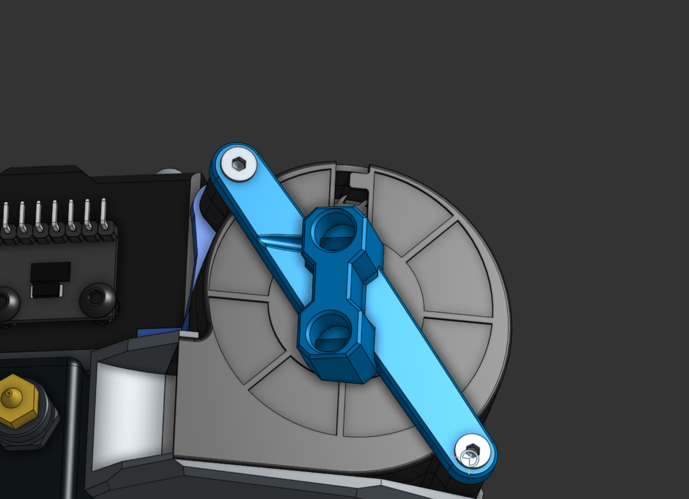
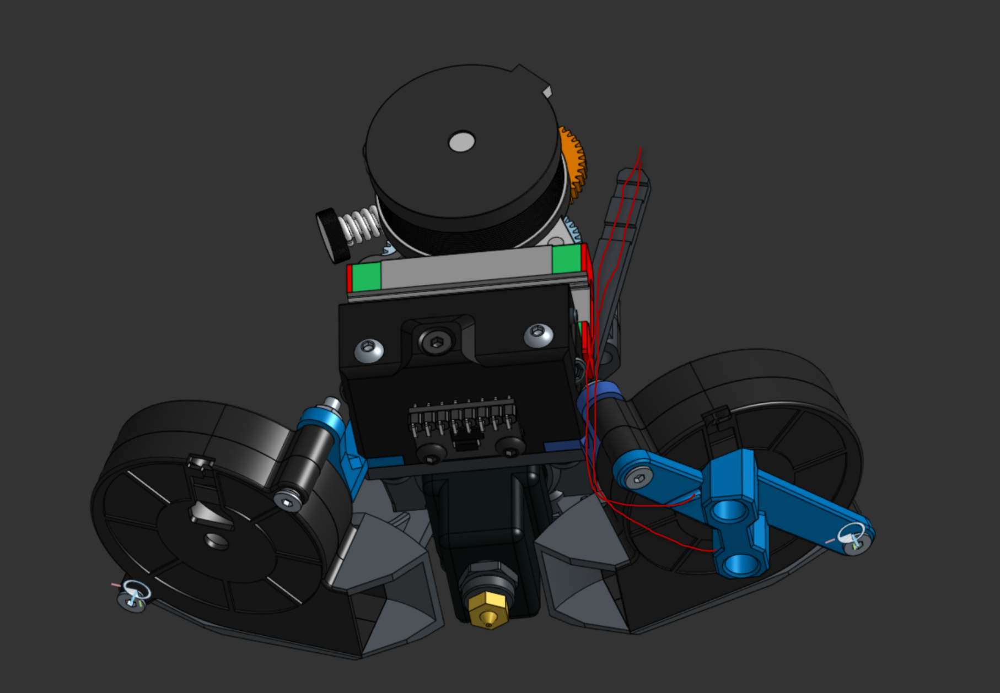

I've been calling it "klicky", but this is technically the annex quickdraw probe that the LH Stinger uses. I wanted to get PCB Klicky initially, but I obviously couldn't have mounted it on the side, as it's much bulkier. Only option would have been mounting it behind the hotend, like most toolheads do, but since this is a Cartesian not CoreXY toolhead I don't have that much X. So this'll have to do for now. 

** Time Spent: 4h**

# 20-21/03/2026 5:04 a.m. : Polishing README
I really wanted to run some CFD, but Unfortunately that was not to be. Struggled for about two hours with Simscale trying to adapt [this tutorial](https://www.youtube.com/watch?v=1pMJQetyA4A&pp=ygUbc2ltc2NhbGUgdHV0b3JpYWwgY2ZkIGR1Y3Rz) for the rather weird 3 wall ducts the Mjolnir has (I was planning to first do CFD on the Mjolnir for practice and then do that on my toolhead and compare the results). I'll have to spend a day or two messing around with SimScale and learning how to use it properly before I'll be able to run CFD. I'll just do that later and update the ducts+readme then, cause both are pretty easy to do. 

Wrote the README, and also changed the name from Boreas to Aeolus. Why? Well Aeolus is the Greek god of winds, the "Keeper of Winds", and I think that as a figure is pretty darn cool and also since Boreas means "North Wind" I'd like to keep that for the sheet cooling mod I'll be designing later on, as it'd fit perfectly, as the cooling will actually come from the north. Also spent about an hour making this really cool (in my opinion) drawing to use instead of a render, as I really don't have time to mess with Blender right now. What's pretty arn awesome in my opinion is that you can generate views from assemblies/part studios for drawings in Onshape. Haven't completely gotten the hang of it, and the elements are not centered or anything, but it'll do for now. 

In the future, I'd like to maybe change the color scheme, make some sort of a minimalist logo (maybe an old with a long beard with gusts going outwards from him in all directions), and also adjust the line thickness and everything of the drawing. 

Ah and also made the BOM. I still have to get a 683 bearing as I'm using Kevin's modified Protoxtruder version, an Omron D2F-5 switch (I'll get that from mouse with another order I'm making, as it's much cheaper than on Ali with shipping and also genuine), and also all the screws. I have a bunch of M3 screws around here but I'll probably need a set of shoulderbolts as well. Asked Kevin and he said that he got the 683 bearing from Fushi. Might request a topup to batch everything into one order. 
Well in conclusion I'm pretty satisfied with what I've been able to achieve for a first try at making a toolhead. We'll see once I build it haha.

**Time Spent: 6h**

