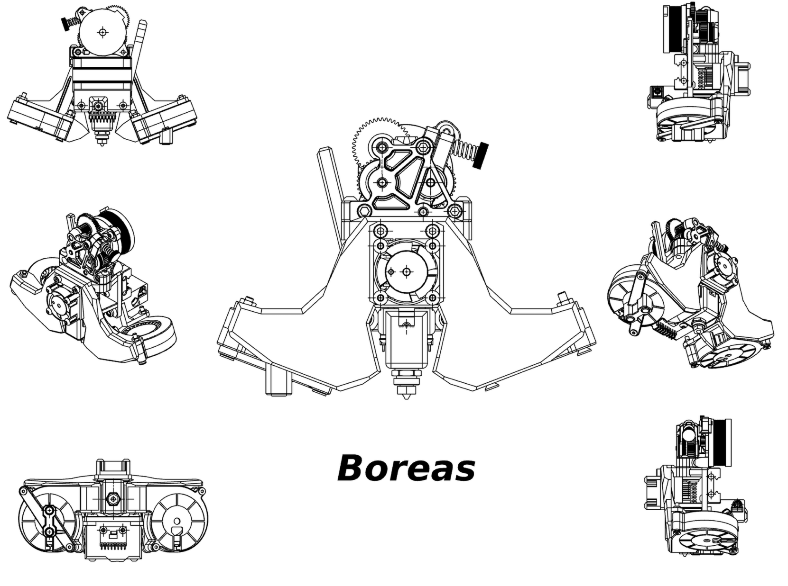
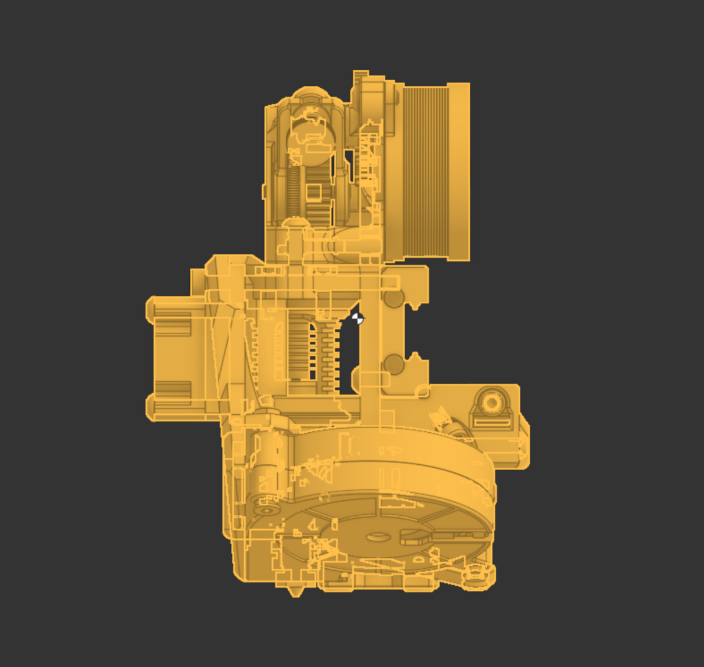

# Aeolus 
Boreas is a toolhead made for Cartesian 3D printers with an LH Stinger style belt path. 

# Key Features
- Dual 5015 blowers, positioned near the nozzle using short ducts for the best airflow possible. 
- Lightweight. All printed parts (including the probe mount but excluding the tensioner) are 55.548g using the PC/ABS material in Onshape. For reference, all the Mjolnir printed parts are about 76g using the same material.
- Rigid. Ribs on the main front fan mount as well as separate back braces for each fan ensure rigidity. Aforementioned front fan mount (the "wings") also mounts directly through the cage and into the carriage. 
- No frills design. Simple yet reliable design, inspired by the Archetype Mjolnir but without all the extra core objects.
- Compatible with the Dragon Ace Volcano and Protoxtruder. 
- Decent COM.  
  - 
- High nozzle visibility.
- Uses a modified Stinger tensioner block. 
  
# Gallery
Coming soon!   

# BOM
  

  
# Notes 
- Please note that while this may look much like the Mjolnir, it is in no way a remix. This toolhead was designed from scratch, the only similarity with the Mjlonir being the the placement of the fans and the ducts. 
- Using this on standard Cartesian gantries involves losing some bed space. This design was made with my custom printer in mind (more detail to be added here later). 
  
# Credits
- The [Archetype Mjolnir](https://github.com/Armchair-Heavy-Industries/Archetype/tree/main/Archetype%20-%20Mjolnir) for referencing the rough fan position and the ducts.
- The [LH Stinger](https://github.com/lhndo/LH-Stinger) for **many** references, such as the rough toohead cage dimensions, hotend placement, tensioner block, and quickdraw probe mount. 

