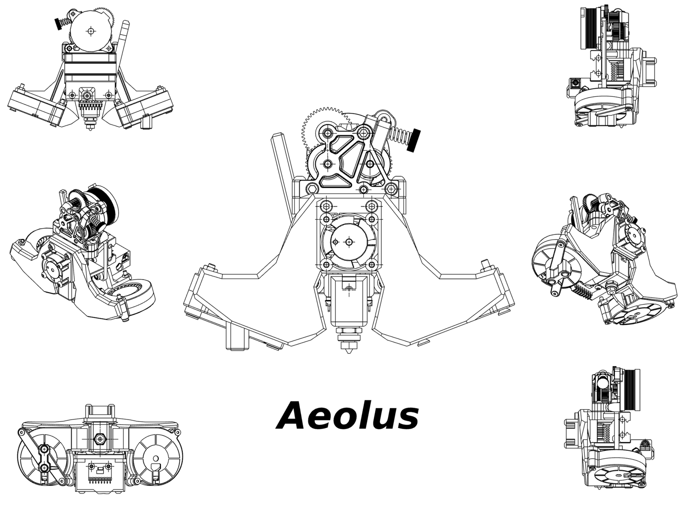

  <em>Aeolus - Greek god of the winds, also known as "Keeper of Winds".</em>

# Key Features
- Dual 5015 blowers, positioned near the nozzle using short ducts to achieve optimal airflow.
- Lightweight. All printed parts (including the probe mount but excluding the tensioner) come in 55.548g using PC/ABS in Onshape. For reference, all Mjolnir printed parts are approximately 76g using the same material.
- Rigid. Structural ribs on the main front fan mount, along with separate rear braces for each fan. The front fan mount ("wing") also mounts directly through the cage into the carriage.
- No-frills design. Simple yet reliable design, inspired by the Archetype Mjolnir but without all the extra core objects
- Compatible with the Dragon Ace Volcano and Protoxtruder. 
- Decent COM.  
  

    
Show COM image

    

  

- High nozzle visibility.
- Uses a modified Stinger tensioner block and a Stinger belt path.
  
# Gallery
Coming soon!   

# BOM
*Note: this is only for parts acquired using the Rework grant. A more detailed general BOM will be added soon.*
| Item | Price | Source |
|------|-------|--------|
| Gdstime 5015 24V Dual Ball 8500RPM Fan x 2 | $15.60 | [AliExpress](https://www.aliexpress.com/item/32865977791.html?aff_fcid=37390794bd2a44fb915c6714a564fe7a-1774057126050-07875-_Dlo2xAd&tt=CPS_NORMAL&aff_fsk=_Dlo2xAd&aff_platform=shareComponent-detail&sk=_Dlo2xAd&aff_trace_key=37390794bd2a44fb915c6714a564fe7a-1774057126050-07875-_Dlo2xAd&terminal_id=561ea4d3ea7047b18bd93c88c0563fc8&afSmartRedirect=y) |
| Gdstime 2510 24V Dual Ball 12000RPM Fan | $10.20 | [AliExpress](https://www.aliexpress.com/item/1005009268854960.html?pdp_npi=4%40dis!USD!US%20%245.44!US%20%245.13!!!5.44!5.13!%402103849717740577375362379ef70e!12000048588190275!sh!RO!6269058475!X&spm=a2g0o.store_pc_allItems_or_groupList.new_all_items_2007447259855.1005009268854960) |
| HGX Lite Gears | $28.50 | [AliExpress](https://www.aliexpress.com/item/1005004699143725.html) |
| Pancake Nema14 Motor | $13.00 | [AliExpress](https://www.aliexpress.com/item/1005006423228157.html?spm=a2g0o.productlist.main.1.22c631pQ31pQRU&algo_pvid=88002b4b-ed16-4c4b-af01-e22d32c9017d&algo_exp_id=88002b4b-ed16-4c4b-af01-e22d32c9017d-13&pdp_ext_f={%22order%22%3A%221479%22%2C%22spu_best_type%22%3A%22price%22%2C%22eval%22%3A%221%22%2C%22fromPage%22%3A%22search%22}&pdp_npi=6%40dis!USD!12.87!11.74!!!88.18!80.42!%402103890117740586313942752e86bd!12000040650309424!sea!RO!6269058475!X!1!0!n_tag%3A-29919%3Bd%3A6fbfa3cb%3Bm03_new_user%3A-29895&curPageLogUid=x9JWPe7uGud4&utparam-url=scene%3Asearch%7Cquery_from%3A%7Cx_object_id%3A1005006423228157%7C_p_origin_prod%3A) |
| ADXL345 | $4.00 | [AliExpress](https://www.aliexpress.com/ssr/300000512/BundleDeals2?spm=a2g0o.productlist.main.1.153774228rG1b5&productIds=1005006863802719:12000038553198349&pha_manifest=ssr&_immersiveMode=true&disableNav=YES&sourceName=SEARCHProduct&utparam-url=scene%3Asearch%7Cquery_from%3A%7Cx_object_id%3A1005006863802719%7C_p_origin_prod%3A1005007997362605&pvid=f50b8748-be95-42c2-9858-986f3f049b5b) |
| 6x3 Magnets | $4.25 | [AliExpress](https://www.aliexpress.com/ssr/300000512/BundleDeals2?spm=a2g0o.productlist.main.1.73a7wwYAwwYALh&productIds=1005009582297751:12000049533872034&pha_manifest=ssr&_immersiveMode=true&disableNav=YES&sourceName=SEARCHProduct&utparam-url=scene%3Asearch%7Cquery_from%3A%7Cx_object_id%3A1005009582297751%7C_p_origin_prod%3A1005009935005981&pvid=d844df5e-1c67-4654-b87c-1f3d7f9e5246) |
| **Total** | **$75.55** |  |rom%3A%7Cx_object_id%3A1005009582297751%7C_p_origin_prod%3A1005009935005981&pvid=d844df5e-1c67-4654-b87c-1f3d7f9e5246 |

  
# Notes 
- Please note that while this may look much like the Mjolnir, it is in no way a remix. This toolhead was designed from scratch, the only similarity with the Mjlonir being the the placement of the fans and the ducts. 
- Using this on standard Cartesian gantries involves losing some bed space. This design was made with my custom printer in mind (more detail to be added here later). 
  
# Credits
- The [Archetype Mjolnir](https://github.com/Armchair-Heavy-Industries/Archetype/tree/main/Archetype%20-%20Mjolnir) for referencing the rough fan position and the ducts.
- The [LH Stinger](https://github.com/lhndo/LH-Stinger) for **many** references, such as the rough toohead cage dimensions, hotend placement, tensioner block, and quickdraw probe mount. 

# License
Aeolus is licensed under CERN-OHL-P-2.0
